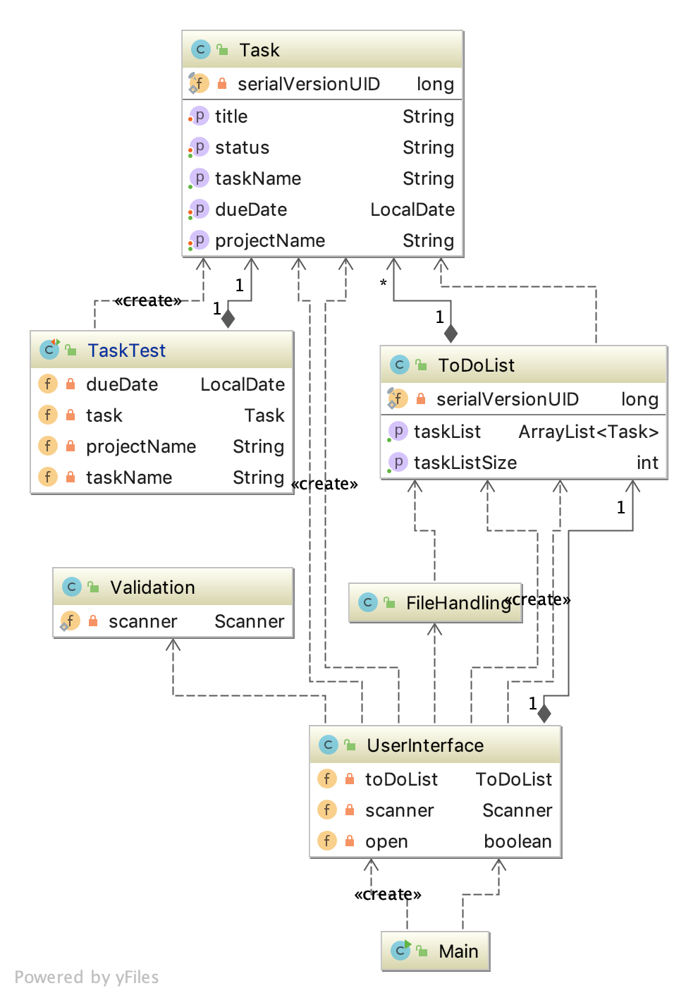

# app.ToDoList
# Description
The application will allow a user to create new tasks, assign them a title and due date, and choose a project for that task to belong to. Once they are using the application, the user should be able to also edit, mark as done or remove tasks. They can also quit and save the current task list to file, and then restart the application with the former state restored.

<h3>Class Diagram</h3>

